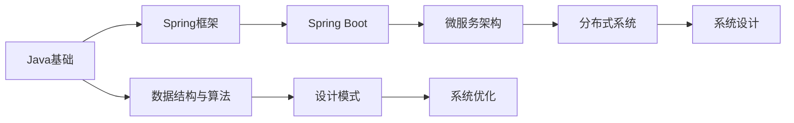

<!-- 动态打字效果 -->
<div align="center">
  <a href="https://github.com/1634594707">
    
  </a>
</div>

<h3 align="center">🚀 Backend Developer | AI Enthusiast | From Hangzhou, China 🇨🇳</h3>

<br>

<!-- 个人简介卡片 -->
<div align="center">
  
  
</div>

<br>

<!-- 关于我 -->
## 👨‍💻 About Me

```typescript
const jiangHaoCheng = {
    location: "杭州 · 中国",
    education: "温州大学 - 人工智能专业",
    role: "后端开发工程师",
    interests: ["Java后端开发", "Spring生态", "分布式系统", "人工智能"],
    
    techStack: {
        backend: ["Java", "Spring Boot", "MyBatis", "Spring Cloud"],
        database: ["MySQL", "Redis", "PostgreSQL", "Neo4j"],
        tools: ["Docker", "Git", "Maven", "Nginx"],
        learning: ["微服务架构", "消息队列", "系统设计"]
    },
    
    motto: "代码质量与系统可维护性至上 💻",
    currentFocus: "在实战项目中不断提升工程能力 🎯"
};
```

<br>

<!-- 技术栈 -->
## 🛠️ Tech Stack

<div align="center">

### 后端开发


### 数据库


### 开发工具


### 其他技术


</div>

<br>

<!-- GitHub 统计 -->
## 📊 GitHub Statistics

<div align="center">
  
  
</div>

<br>

<!-- GitHub 奖杯 -->
<div align="center">
  
</div>

<br>

<!-- 贡献蛇 -->
<picture>
  <source media="(prefers-color-scheme: dark)" srcset="https://raw.githubusercontent.com/1634594707/1634594707/output/github-contribution-grid-snake-dark.svg">
  <source media="(prefers-color-scheme: light)" srcset="https://raw.githubusercontent.com/1634594707/1634594707/output/github-contribution-grid-snake.svg">
  
</picture>

<br>

<!-- 项目亮点 -->
## 🌟 Featured Projects

<div align="center">

[](https://github.com/1634594707/homepage)

</div>

<br>

<!-- 学习路线 -->
## 📚 Learning Journey



<br>

<!-- 联系方式 -->
## 📫 Connect With Me

<div align="center">
  
[](https://github.com/1634594707)
[](mailto:1634594707@qq.com)
[](https://github.com/1634594707/homepage)

</div>

<br>

<!-- 访问统计 -->
<div align="center">
  
</div>

<br>

<!-- 励志名言 -->
<div align="center">
  
</div>

<br>

---

<div align="center">
  
### 💡 "注重代码质量与系统可维护性，在实战中不断成长"

**⭐ 如果你喜欢我的项目，欢迎 Star 支持！**

</div>

<!-- 底部波浪 -->

